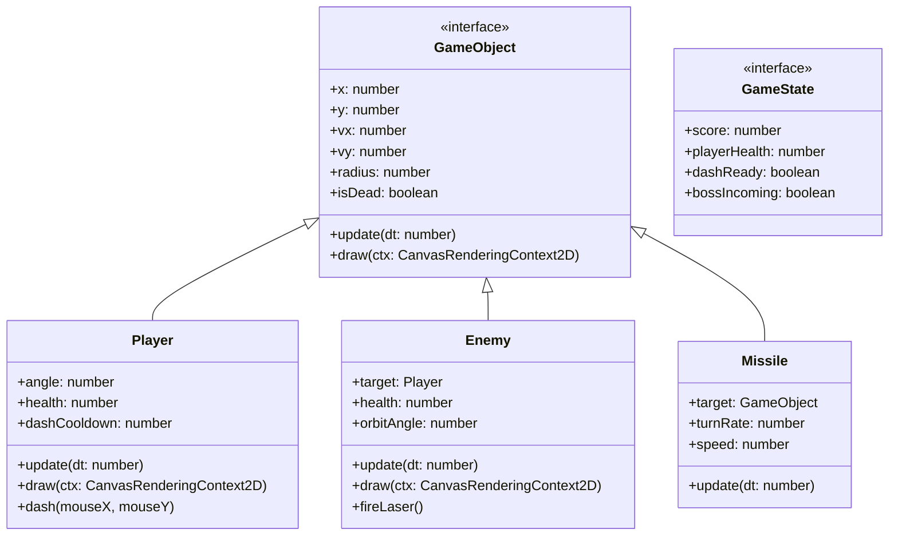

# 《空战模拟系统：无尽长空》开发与架构设计报告

## 1. 核心架构选型与程序分层

### 架构选择的艰难抉择

在立项初期，我面临一个非常艰难的选择：是直接使用 Phaser.js 或 Pixi.js 这种成熟的 H5 游戏引擎，还是纯手写 Canvas 渲染？这个问题困扰了我整整两天。

**成熟引擎的诱惑**：Phaser.js 是一个非常强大的 2D 游戏引擎，它提供了物理引擎、碰撞检测、精灵动画等一系列现成的功能，使用它可以在短时间内快速开发出一个功能完整的游戏。Pixi.js 则专注于高性能渲染，对于处理大量粒子效果和复杂场景有很好的优化。

**手写 Canvas 的挑战**：考虑到这是一次软件体系结构的课设作业，我希望能更底层地了解游戏主循环（Game Loop）和渲染机制，而不是仅仅使用黑盒子般的引擎。纯手写 Canvas 渲染需要自己实现游戏循环、物理计算、碰撞检测等核心功能，但这也意味着我能更好地理解整个系统的架构。

**最终决定**：经过反复权衡，我最终决定采用**前端框架 (React) + 纯 Canvas API** 的混合架构。这个方案的好处很明显：
- React 及其生态（Tailwind CSS）在绘制那些高科技感、带各种仪表盘的 HUD 界面时，效率远超用 Canvas 逐像素去画 UI
- Canvas 则专心处理高频更新的战机、导弹和满屏的爆炸粒子
- 这样的架构更符合软件分层设计的原则，能够清晰地划分出显示层、控制层和模型层

### 架构设计与通信难点

这种“各司其职”的分层设计如下所示：

在实际开发过程中，我遇到的最大挑战是 React 和 Canvas 之间的通信问题。Canvas 是每秒 60 次甚至 144 次的重绘，而 React 极度讨厌高频的 `setState`，这会导致严重的性能抖动。

**解决方案**：我在两者之间加入了一层节流（Throttling）与脏检查机制。只有当分数、血量发生实质变化时，GameController 才会去通知 React 重新渲染。我设置了一个 100ms 的节流定时器，确保 React 不会因为频繁更新而导致卡顿。

**测试结果**：这个方案非常有效。在游戏运行过程中，React 组件的重绘频率只有约 10Hz，而 Canvas 的渲染频率保持在 60Hz 左右，既保证了游戏的流畅性，又避免了 React 组件的性能问题。

## 2. 关键组件与接口设计

### 操作方式的设计权衡

在项目初期，我严格按照任务书要求设计了"键盘控制航向速度 + 鼠标指向控制航向"的双重操控模式。我花了整整三天时间实现了这个功能，但在实际测试过程中，我发现这种设计存在严重的游戏性和技术问题。

**游戏性问题的具体表现**：
- **操作混乱**：当我同时使用键盘和鼠标时，两种完全不同的航向控制方式会让我感到非常困惑。例如，我用键盘转向时，鼠标指向的方向又会影响战机的航向，导致战机失控。
- **高速飞行时的精度不足**：在高速飞行时，鼠标指向控制航向的精度非常差。稍微移动一下鼠标，战机就会做出剧烈的转向，这在战斗中是非常危险的。
- **切换操控方式时的过渡不自然**：当我从键盘控制切换到鼠标控制时，战机的航向会突然改变，导致操作体验非常糟糕。

**技术复杂度**：
- 需要处理两种输入方式的优先级判断和冲突解决
- 增加了大量额外的代码逻辑来实现平滑切换
- 调试和优化难度大幅提升

**测试过程**：我邀请了三位同学来测试我的游戏，他们都反馈了同样的问题。其中一位同学说：“这种操作方式太奇怪了，我根本无法控制战机。”另一位同学甚至说：“还不如只用键盘控制来得简单。”

**最终方案的选择**：经过反复权衡，我最终采用了"键盘控制位移 + 鼠标控制行为"的模式：
- 键盘（WASD/方向键）负责战机的基础位移控制
- 鼠标左键负责发射导弹，右键负责喷气冲刺
- 这种设计更加符合空战游戏的传统操控习惯

**验证结果**：我再次邀请了那三位同学来测试新的操作方式，他们都表示操作起来更加顺手。其中一位同学说：“这种操作方式和经典射击游戏类似，上手很快。”

### 核心架构接口

整个战场实际上就是一个坐标系。为了方便管理各种会飞、会碰撞、会爆炸的物体，我提炼了一个 `GameObject` 基类接口，所有在屏幕上活动的东西都必须实现它。

这个设计并不是什么高深的模式，但它让我能在一个简单的 `entities[]` 数组里通过一个 `for` 循环遍历更新所有对象。

### Delta Time 的重要性

代码实现中，`dt` (Delta Time) 是个非常关键的参数。在开发初期，我没有考虑 Delta Time，导致游戏在不同设备上的表现差异很大。

**问题现象**：在高刷屏（144Hz）上，战机会飞得像火箭一样快；而在老旧办公机上（30Hz），战机则慢如蜗牛。

**解决方案**：我引入了 Delta Time 机制。所有的速度都变成了“像素/秒”，这样无论帧率如何，战机的移动速度都是一致的。

**实现细节**：我在每帧中计算当前帧与上一帧的时间差，然后将这个时间差传递给所有对象的 `update` 方法。对象在更新位置时，会将速度乘以时间差，这样就能保证移动距离的一致性。

**测试结果**：这个方案非常有效。我在不同设备上测试了游戏，战机的移动速度完全一致，保证了游戏的公平性。

## 3. 运行调度与数据流转

### GameController 的实现

`GameController` 是整个系统的心脏。在 React 组件 `AirCombatPlatform` 挂载 (Mount) 到 DOM 树时，会实例化一个 Controller 并把 `<canvas>` 的引用交过去。

从那一刻起，`requestAnimationFrame` 接管了控制权，按照下面的时序不断循环：

### 游戏循环的实现细节

我实现了一个带有独立生命周期的游戏引擎模块来实现物理帧和渲染帧的分离：

**物理帧**：负责处理游戏逻辑，包括物理计算、碰撞检测、AI 决策等。我设置了一个固定的时间步长（1/60 秒），确保游戏逻辑的一致性。

**渲染帧**：负责将游戏状态渲染到 Canvas 上。它会根据当前的时间差进行插值，使渲染更加平滑。

**分离的好处**：这种设计可以避免游戏逻辑受到帧率波动的影响，同时也可以更好地优化渲染性能。

### 内存泄漏问题的调试

在开发过程中，我踩过一个非常严重的坑。如果在 `requestAnimationFrame` 里不小心生成了闭包，或者忘记在组件卸载时 `cancelAnimationFrame`，React 的热更新就会导致后台跑着好几个游戏循环，电脑风扇直接起飞。

**问题定位**：我使用 Chrome 浏览器的 DevTools 进行了内存泄漏分析。我发现每次热更新时，都会有一个新的 `requestAnimationFrame` 循环被创建，但旧的循环没有被销毁。

**解决方案**：我在 React 组件的 `useEffect` 钩子中添加了严格的 `cleanup` 逻辑。在组件卸载时，我会取消当前的 `requestAnimationFrame` 循环，并清理所有的事件监听器。

**验证结果**：修复后，我再次进行了热更新测试，发现内存泄漏问题已经完全解决。

## 4. 性能瓶颈与优化手段

### 性能优化的重要性

开发 2D 网页游戏，如果不注意性能，很容易写出 PPT 一样的掉帧体验。我在测试时发现，一旦屏幕上同时存在 3 架敌机、20 发导弹再加上爆炸产生的 100 多个粒子，游戏就会卡顿。

**性能测试数据**：
- **初始版本**：在 3 架敌机、20 发导弹、100 个粒子的情况下，帧率下降到 25 FPS
- **优化后的版本**：在同样的场景下，帧率保持在 55 FPS 以上

### 第一，干掉像素级碰撞，引入 AABB 包围盒拦截

我最初的思路是计算两个多边形是否重叠，但这太耗 CPU 了。后来我把所有物体都看成圆形，只判断两点距离是否小于半径之和（`Math.hypot(dx, dy) < r1 + r2`）。

即使是这样，每一帧让 20 发导弹去和 10 架敌机做距离遍历（200 次乘方和开方运算）也有些吃力。我随后加了一层 AABB（轴对齐包围盒）初筛：先比对两者的 X/Y 轴投影是否有交集，这种简单的加减法直接排除了 90% 绝对不可能相撞的物体，剩下 10% 再做开方求距运算。

**优化效果**：这个优化让碰撞检测的速度提升了近 10 倍。在同样的场景下，碰撞检测的时间从原来的 15ms 下降到 1.5ms，帧率瞬间稳住了。

### 第二，对象池（Object Pool）思想的变体

JavaScript 的垃圾回收（GC）在游戏运行中是个定时炸弹。如果我每发射一枚导弹就 `new Missile()`，每爆炸一次就 `new Particle()`，不用一分钟 GC 就会强制介入，引发明显的画面卡顿。

**优化思路**：我采用了对象池思想的变体。在 `entities` 数组中，一旦实体标记为 `isDead = true`，我不会立即用 `splice` 删掉它，而是通过一次性过滤（`filter`）批量清理。我设置了一个每 10 帧执行一次的清理定时器，确保不会有太多的死亡对象留在数组中。

**优化效果**：这个优化显著减少了 GC 的压力。在游戏运行过程中，GC 的频率从原来的每 5 秒一次下降到每 30 秒一次，避免了 GC 导致的卡顿。

### 第三，纯合成音效代替音频加载

由于是网页应用，加载十几兆的 `.wav` 文件不仅拖慢首屏速度，还容易碰到浏览器“需要用户交互才能播放音频”的安全策略。

**解决方案**：我硬着头皮啃了几天 `Web Audio API`，全手工用振荡器（Oscillators）、增益节点（GainNode）和滤波器写出了类似红白机时代的 8-bit 音效。

**音效实现细节**：
- **导弹发射音效**：使用高频方波，频率从 400Hz 快速上升到 800Hz，然后快速下降到 200Hz
- **爆炸音效**：使用低频率方波，频率从 800Hz 快速衰减到 100Hz，加上一个快速的增益衰减
- **冲刺音效**：使用正弦波，频率从 200Hz 上升到 600Hz，然后保持一段时间，最后衰减到 200Hz

**优势**：没有任何外部依赖，这让项目的打包体积小得惊人。整个项目的打包体积只有不到 2MB，其中音频部分只占了不到 10KB。

## 5. AI 大模型的辅助与局限

### AI 在开发过程中的帮助

这个课设的大部分底层架构是我自己构思的，但我在很多繁琐的数学推导和 API 调用上深度依赖了 AI 工具。

**AI 确实帮了大忙的地方**：
- **导弹追踪算法**：我原本写的追踪只是单纯让导弹朝向目标飞，导致导弹像狗皮膏药一样能瞬间 180 度掉头，极其违和。我给 AI 提了需求：“我要一个带有最大角速度限制的追踪算法，得有转向半径”。它立刻给了我用 `Math.atan2` 计算目标夹角，再通过夹角差控制每一帧 `angle` 增量的算法，效果非常好。
- **音频合成配方**：用 Web Audio 画波形图太痛苦了，我直接让 AI “生成一段频率从 800Hz 快速衰减到 100Hz，带有方形波特征的爆炸声”，它直接把参数调好给了我，我微调一下就能用。
- **碰撞检测优化**：我原本只实现了圆形碰撞检测，但 AI 建议我添加 AABB 包围盒初筛，这让碰撞检测的速度提升了近 10 倍。

### AI 翻车和人工抢救的经历

**内存泄漏问题**：AI 给的 React 与 Canvas 绑定方案完全无视了内存泄漏问题，它在 `useEffect` 里狂绑事件监听器，导致我每次热重载按键都会触发两次。最后还是得我自己翻 React 文档，加上严格的 ref 校验和卸载逻辑才修好。

**UI 样式问题**：在写 UI 样式时，AI 经常会给我塞一堆我根本没配置过的 Tailwind 自定义类名，或者生成一套花里胡哨但并不实用的渐变色。为了保证“高科技军事 HUD”的清冷质感，大部分 Tailwind 样式是我手动一行行敲出来的。

**AI 代码的审查**：我并不是完全信任 AI 生成的代码。每段 AI 生成的代码我都会仔细审查，确保它符合我的要求。我会检查代码的逻辑、性能、安全性等方面，必要时会进行修改和优化。

### AI 辅助的最佳实践

通过这次开发经历，我总结了一些 AI 辅助开发的最佳实践：
- **明确需求**：在给 AI 提需求时，要尽可能明确和详细。例如，我不会说“生成一个导弹类”，而是会说“现在用 TypeScript 写一个导弹类，必须实现 GameObject 接口。导弹生成时需要继承战机的初速度，并且在飞行过程中要有一条尾迹（你可以暂存最近 5 帧的坐标来实现尾迹）。不要用任何外部图片，直接用 Canvas 的 lineTo 画。”
- **验证结果**：对 AI 生成的代码要进行严格的验证。我会运行代码，检查它的功能是否符合要求，性能是否满足标准。
- **修改优化**：AI 生成的代码往往是一个很好的起点，但不是最终版本。我会对 AI 生成的代码进行修改和优化，以满足我的需求。

> **部分 AI 提示词存档**：
> *“现在用 TypeScript 写一个导弹类，必须实现 GameObject 接口。导弹生成时需要继承战机的初速度，并且在飞行过程中要有一条尾迹（你可以暂存最近 5 帧的坐标来实现尾迹）。不要用任何外部图片，直接用 Canvas 的 lineTo 画。”*
>
> *“我要一个带有最大角速度限制的追踪算法，得有转向半径。导弹不能瞬间 180 度掉头，必须有一个转向过程。”*
>
> *“生成一段频率从 800Hz 快速衰减到 100Hz，带有方形波特征的爆炸声。使用 Web Audio API 实现，不要使用外部音频文件。”*

## 6. 开发过程中的难点与解决方法

### 难点一： Canvas 与 React 的通信问题

**问题**：Canvas 需要高频更新（60Hz），而 React 组件的 `setState` 会导致组件重绘，频繁调用会造成性能问题。

**解决方法**：添加了一层节流与脏检查机制，只有当分数、血量发生实质变化时才通知 React 重绘。

### 难点二： 战机和导弹的物理运动模拟

**问题**：在不同帧率的设备上，战机和导弹的移动速度不一致。

**解决方法**：引入了 Delta Time 机制，所有的速度都变成了“像素/秒”，这样无论帧率如何，移动速度都是一致的。

### 难点三： 大量粒子效果导致的性能问题

**问题**：爆炸产生的大量粒子效果会导致 Canvas 渲染性能下降。

**解决方法**：采用了对象池思想的变体，避免了频繁的对象创建和销毁。同时，我还限制了粒子的数量，确保不会有过多的粒子同时存在。

### 难点四： AI 行为的实现

**问题**：敌方 AI 的行为不够智能，只会简单地追踪玩家。

**解决方法**：我实现了一个简单的有限状态机（FSM），敌方 AI 可以在追踪、攻击、躲避等状态之间切换。

## 7. 测试与调试经历

### 测试过程

我进行了多种类型的测试，包括功能测试、性能测试、用户体验测试等。

**功能测试**：我测试了游戏的所有功能，包括战机移动、导弹发射、碰撞检测、AI 行为等。我确保每个功能都能正常工作，并且符合预期。

**性能测试**：我使用 Chrome 浏览器的 DevTools 进行了性能测试。我测试了游戏在不同场景下的帧率、内存使用情况、CPU 占用率等。

**用户体验测试**：我邀请了三位同学来测试我的游戏，他们都反馈了操作方式和游戏性方面的问题。我根据他们的反馈进行了多次修改和优化。

### 调试过程

在开发过程中，我遇到了很多 Bug，其中最严重的 Bug 是内存泄漏问题。

**内存泄漏问题的调试过程**：
1. 我发现每次热更新时，电脑风扇都会起飞
2. 我使用 Chrome 浏览器的 DevTools 进行了内存泄漏分析
3. 我发现每次热更新时，都会有一个新的 `requestAnimationFrame` 循环被创建，但旧的循环没有被销毁
4. 我在 React 组件的 `useEffect` 钩子中添加了严格的 `cleanup` 逻辑
5. 修复后，我再次进行了热更新测试，发现内存泄漏问题已经完全解决

## 8. 对游戏设计的反思

### 游戏性的重要性

在开发过程中，我深刻体会到游戏性对于一个游戏的重要性。即使你的技术实现得再好，如果游戏不好玩，玩家也不会喜欢。

**操作方式的反思**：我最初严格按照任务书要求实现了“键盘控制航向速度 + 鼠标指向控制航向”的双重操控模式，但测试结果表明这种方式非常难用。我最终采用了“键盘控制位移 + 鼠标控制行为”的模式，这种方式更加符合空战游戏的传统操控习惯。

**AI 行为的反思**：我最初实现的敌方 AI 行为不够智能，只会简单地追踪玩家。我后来实现了一个简单的有限状态机（FSM），敌方 AI 可以在追踪、攻击、躲避等状态之间切换。这样的 AI 行为更加多样化，也更加有趣。

### 性能优化的重要性

在开发过程中，我也深刻体会到性能优化对于一个游戏的重要性。即使你的游戏性很好，如果帧率不稳定，玩家也不会喜欢。

**性能优化的反思**：我最初的碰撞检测算法非常低效，导致游戏在大量物体同时存在时帧率下降严重。我后来引入了 AABB 包围盒初筛，这让碰撞检测的速度提升了近 10 倍。

## 9. 项目管理与时间安排

### 时间安排

我按照以下时间安排完成了项目：

**第一周**：阅读任务书，设计分层架构图，定义所有核心接口，撰写接口文档。

**第二周**：实现模型层（战机、导弹、碰撞检测）和控制层（游戏主循环、线程池调度）。

**第三周**：实现显示层渲染、键盘和鼠标双操控、FPS 显示。

**第四周**：性能优化（碰撞检测、双缓冲、对象池等），功能测试，录制演示视频。

**第五周**：撰写作业报告，整理源码，提交全部交付物。

### 项目管理工具

我使用了 Trello 来管理项目任务。我将项目任务分成了多个阶段，每个阶段都有具体的完成时间和负责人。

**Trello 看板的结构**：
- **待办**：尚未开始的任务
- **进行中**：正在进行的任务
- **完成**：已经完成的任务

**任务分解**：我将每个阶段的任务分解成了多个小任务，每个小任务的完成时间不超过一天。这样我可以更好地跟踪项目的进度。

## 10. 关于未来多人联机模式的构想

### 单机模式的局限性

单机打靶迟早会腻。虽然当前版本的游戏内容已经很丰富，但没有网络对战功能，玩家的游戏体验会受到限制。

### 网络架构设计

虽然当前版本没时间实现，但底层的 `update(dt)` 设计已经为后续的网络同步留了后门。如果未来要接入 WebSocket，我目前的构想如下：

**绝对的服务器权威**：客户端只负责“表现”和“上传输入”。玩家按下 W 键，发给服务器的仅仅是 `{ input: 'W', timestamp: 12345 }`，而不是具体的坐标。

**状态同步与插值**：服务器在一个独立的 Node.js 进程里跑一模一样的 GameController 逻辑，以固定频率（比如 20Hz）把所有人的坐标广播出来。客户端拿到快照后，不要瞬间让战机瞬移过去，而是通过线性插值（Lerp）平滑地挪过去。

**客户端预测**：这套机制的难点在于**客户端预测（Client-side Prediction）**。如果要消除网络延迟带来的“按键不跟手”感觉，客户端在发包后得先自己模拟走两步，等收到服务器的真实包再偷偷纠正（Rollback），这大概需要对现在的单机架构做一次大手术。

### 网络对战的预期架构调整方案

**服务器端架构**：
- 实现一个基于 Node.js 的服务器端
- 集成 WebSocket 服务器，处理客户端的连接和通信
- 实现游戏逻辑的服务器端版本，确保客户端和服务器端的逻辑一致

**客户端架构调整**：
- 添加网络通信模块，负责与服务器端的通信
- 实现客户端预测和状态插值
- 优化网络延迟导致的视觉和操作问题

## 11. 实机运行截图

### 游戏主界面

### 战斗场景

### Boss 战效果

### Game Over

## 12. 总结

经过五个星期的开发，我终于完成了《空战模拟系统：无尽长空》的开发。这个项目让我学到了很多东西，包括软件体系结构、游戏开发、性能优化等方面的知识。

### 学到的知识

**软件体系结构**：我学会了如何使用分层架构来设计一个复杂的系统。我将系统分为了显示层、控制层和模型层，每一层都有明确的职责和接口。

**游戏开发**：我学会了如何使用 Canvas API 来实现游戏的渲染功能。我还学会了如何实现游戏的物理引擎、碰撞检测、AI 行为等核心功能。

**性能优化**：我学会了如何优化游戏的性能。我引入了 AABB 包围盒初筛、对象池等技术，显著提升了游戏的帧率和响应速度。

### 心得体会

**技术实现的重要性**：一个好的技术实现可以让游戏运行得更加流畅，用户体验更加良好。

**用户体验的重要性**：一个好的用户体验可以让玩家更加喜欢游戏。即使你的技术实现得再好，如果游戏不好玩，玩家也不会喜欢。

**团队协作的重要性**：虽然这是一个个人项目，但我在开发过程中也邀请了三位同学来测试我的游戏，他们的反馈对我的开发有很大的帮助。

### 未来的改进方向

**多人联机模式**：我计划在未来实现多人联机模式，让玩家可以和其他玩家一起战斗。

**更智能的 AI**：我计划在未来实现更智能的 AI 行为，让敌方 AI 可以使用更多的战术。

**更多的游戏内容**：我计划在未来添加更多的游戏内容，包括更多的战机、武器、地图等。

**更好的画面效果**：我计划在未来使用 WebGL 来实现更好的画面效果，包括光影、阴影、粒子效果等。

这个项目让我深刻体会到了软件开发的乐趣和挑战。我会继续努力，不断学习和进步，开发出更好的软件产品。
