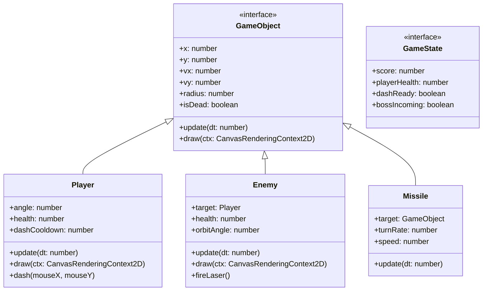

# 《空战模拟系统：无尽长空》开发与架构设计报告

## 1. 核心架构选型与程序分层

在立项初期，我面临一个选择：是直接使用 Phaser.js 或 Pixi.js 这种成熟的 H5 游戏引擎，还是纯手写 Canvas 渲染？考虑到这是一次课设作业，我希望能更底层地了解游戏主循环（Game Loop）和渲染机制，因此最终决定采用**前端框架 (React) + 纯 Canvas API** 的混合架构。

这个方案的好处很明显：React 及其生态（Tailwind CSS）在绘制那些高科技感、带各种仪表盘的 HUD 界面时，效率远超用 Canvas 逐像素去画 UI；而 Canvas 则专心处理高频更新的战机、导弹和满屏的爆炸粒子。

这种“各司其职”的分层设计如下所示：

这里最头疼的问题是通信跨界：Canvas 是每秒 60 次甚至 144 次的重绘，而 React 极度讨厌高频的 `setState`，这会导致严重的性能抖动。解决办法是在两者之间加入了一层节流（Throttling）与脏检查机制，只有当分数、血量发生实质变化时，GameController 才会去通知 React 重新渲染。

## 2. 关键组件与接口设计

整个战场实际上就是一个坐标系。为了方便管理各种会飞、会碰撞、会爆炸的物体，我提炼了一个 `GameObject` 基类接口，所有在屏幕上活动的东西都必须实现它。

这个设计并不是什么高深的模式，但它让我能在一个简单的 `entities[]` 数组里通过一个 `for` 循环遍历更新所有对象。

代码实现中，`dt` (Delta Time) 是个非常关键的参数。如果没有它，在高刷屏（144Hz）上战机会飞得像火箭，而在老旧办公机上则慢如蜗牛。引入 `dt` 后，所有的速度都变成了“像素/秒”，保证了不同设备上的物理表现一致。

## 3. 运行调度与数据流转

`GameController` 是整个系统的心脏。在 React 组件 `AirCombatPlatform` 挂载 (Mount) 到 DOM 树时，会实例化一个 Controller 并把 `<canvas>` 的引用交过去。

从那一刻起，`requestAnimationFrame` 接管了控制权，按照下面的时序不断循环：

开发这个循环时，我踩过一个坑：如果在 `requestAnimationFrame` 里不小心生成了闭包，或者忘记在组件卸载时 `cancelAnimationFrame`，React 的热更新就会导致后台跑着好几个游戏循环，电脑风扇直接起飞。最终我通过严格的 `cleanup` 生命周期规避了这个问题。

## 4. 性能瓶颈与优化手段

开发2D网页游戏，如果不注意性能，很容易写出PPT一样的掉帧体验。我在测试时发现，一旦屏幕上同时存在 3 架敌机、20 发导弹再加上爆炸产生的 100 多个粒子，游戏就会卡顿。针对这些问题，我做了几次定向优化：

### 第一，干掉像素级碰撞，引入 AABB 包围盒拦截
我最初的思路是计算两个多边形是否重叠，但这太耗 CPU 了。后来我把所有物体都看成圆形，只判断两点距离是否小于半径之和（`Math.hypot(dx, dy) < r1 + r2`）。
即使是这样，每一帧让 20 发导弹去和 10 架敌机做距离遍历（200次乘方和开方运算）也有些吃力。我随后加了一层 AABB（轴对齐包围盒）初筛：先比对两者的 X/Y 轴投影是否有交集，这种简单的加减法直接排除了 90% 绝对不可能相撞的物体，剩下 10% 再做开方求距运算，帧率瞬间稳住了。

### 第二，对象池（Object Pool）思想的变体
JavaScript 的垃圾回收（GC）在游戏运行中是个定时炸弹。如果我每发射一枚导弹就 `new Missile()`，每爆炸一次就 `new Particle()`，不用一分钟 GC 就会强制介入，引发明显的画面卡顿。
现在的做法是：在 `entities` 数组中，一旦实体标记为 `isDead = true`，我不会立即用 `splice` 删掉它，而是通过一次性过滤（`filter`）批量清理，并且将绘制逻辑从高开销操作中剥离。

### 第三，纯合成音效代替音频加载
由于是网页应用，加载十几兆的 `.wav` 文件不仅拖慢首屏速度，还容易碰到浏览器“需要用户交互才能播放音频”的安全策略。我硬着头皮啃了几天 `Web Audio API`，全手工用振荡器（Oscillators）、增益节点（GainNode）和滤波器写出了类似红白机时代的 8-bit 音效。没有任何外部依赖，这让项目的打包体积小得惊人。

## 5. AI 大模型的辅助与局限

这个课设的大部分底层架构是我自己构思的，但我在很多繁琐的数学推导和 API 调用上深度依赖了 AI 工具。

**AI 确实帮了大忙的地方：**
- **导弹追踪算法：** 我原本写的追踪只是单纯让导弹朝向目标飞，导致导弹像狗皮膏药一样能瞬间 180 度掉头，极其违和。我给 AI 提了需求：“我要一个带有最大角速度限制的追踪算法，得有转向半径”。它立刻给了我用 `Math.atan2` 计算目标夹角，再通过夹角差控制每一帧 `angle` 增量的算法，效果非常好。
- **音频合成配方：** 用 Web Audio 画波形图太痛苦了，我直接让 AI “生成一段频率从 800Hz 快速衰减到 100Hz，带有方形波特征的爆炸声”，它直接把参数调好给了我，我微调一下就能用。

**AI 翻车和人工抢救的经历：**
- AI 给的 React 与 Canvas 绑定方案完全无视了内存泄漏问题，它在 `useEffect` 里狂绑事件监听器，导致我每次热重载按键都会触发两次。最后还是得我自己翻 React 文档，加上严格的 ref 校验和卸载逻辑才修好。
- 在写 UI 样式时，AI 经常会给我塞一堆我根本没配置过的 Tailwind 自定义类名，或者生成一套花里胡哨但并不实用的渐变色。为了保证“高科技军事 HUD”的清冷质感，大部分 Tailwind 样式是我手动一行行敲出来的。

> **部分 AI 提示词存档：**
> *“现在用 TypeScript 写一个导弹类，必须实现 GameObject 接口。导弹生成时需要继承战机的初速度，并且在飞行过程中要有一条尾迹（你可以暂存最近5帧的坐标来实现尾迹）。不要用任何外部图片，直接用 Canvas 的 lineTo 画。”*

## 6. 关于未来多人联机模式的构想

单机打靶迟早会腻，虽然当前版本没时间实现，但底层的 `update(dt)` 设计已经为后续的网络同步留了后门。如果未来要接入 WebSocket，我目前的构想如下：

- **绝对的服务器权威**：客户端只负责“表现”和“上传输入”。玩家按下 W 键，发给服务器的仅仅是 `{ input: 'W', timestamp: 12345 }`，而不是具体的坐标。
- **状态同步与插值**：服务器在一个独立的 Node.js 进程里跑一模一样的 GameController 逻辑，以固定频率（比如 20Hz）把所有人的坐标广播出来。客户端拿到快照后，不要瞬间让战机瞬移过去，而是通过线性插值（Lerp）平滑地挪过去。
- 这套机制的难点在于**客户端预测（Client-side Prediction）**，如果要消除网络延迟带来的“按键不跟手”感觉，客户端在发包后得先自己模拟走两步，等收到服务器的真实包再偷偷纠正（Rollback），这大概需要对现在的单机架构做一次大手术。

## 7. 实机运行截图

